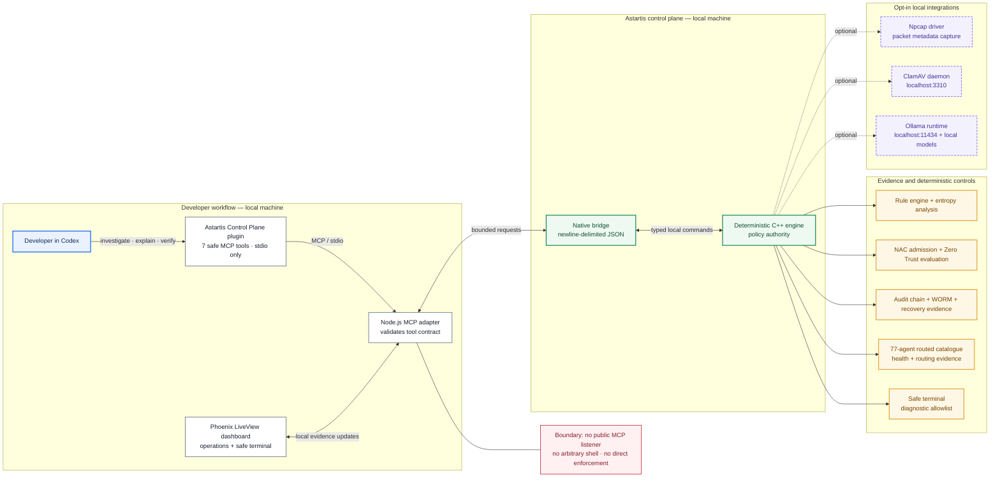

# Astartis x Codex

## I built a developer security control plane around evidence, not opaque automation

I built Astartis because security systems should be useful at the moment a developer has to understand a risk, make a change, and prove that the change worked. Astartis x Codex connects my Windows-first Astartis security engine to Codex through a deliberately narrow local MCP integration.

In this project, Astartis collects and evaluates security evidence through deterministic controls. Codex helps me investigate that evidence, explain a policy decision, plan a focused remediation, and verify the outcome. AI is useful here, but it is not the policy authority: Astartis owns the final security decision.

> **Judge quick start:** On Windows 10/11 x64, install Node.js 20+ and Elixir/Erlang with Mix. Then run the included setup script and dashboard launcher. You do **not** need to rebuild the C++ engine to evaluate the project.

## Why I built Astartis local-first

I am building from Botswana, where I do not want essential security visibility to depend on an always-on cloud connection, a costly API call, or sending sensitive operational data away from the organisation that owns it. Across remote sites and smaller organisations, connectivity, bandwidth, and access to cloud services can be inconsistent or expensive. A security tool should still be able to explain what it saw when the Internet is slow, unavailable, or simply not the right place for the data.

That is why Astartis keeps its core evidence path local:

- the native engine, bridge, dashboard, audit evidence, and Codex MCP adapter run on the same machine for the evaluation path;
- packet capture is opt-in and analyses local metadata rather than uploading packet payloads;
- NAC, Zero Trust, WORM, audit, and recovery evidence are evaluated through deterministic code;
- optional local inference can assist with routing and analysis, but it never overrides the security controls.

Local-first does not mean local-only forever. I designed the boundaries so that the same components can be deployed on a server: the native engine can run with a configured bridge path, the Phoenix dashboard can serve an operations team, and the MCP adapter remains a narrow local developer interface. A production multi-server deployment would need normal infrastructure work—authentication, secret management, tenant isolation, persistent storage, monitoring, and a reviewed deployment design. This repository demonstrates the local developer-control-plane architecture; it does not claim a completed cloud-scale deployment or a performance benchmark it has not run.

## What Astartis is

Astartis is the deterministic security engine behind this project. It combines:

- a rule engine and entropy/chaos analysis for local threat signals;
- WORM-style protected evidence and a hash-linked audit chain;
- NAC admission and Zero Trust access evaluation;
- recovery, decoy, sandbox, attribution, and rule evidence surfaces;
- opt-in local Npcap metadata capture when the driver is installed;
- a safe, allowlisted diagnostic terminal; and
- a routed catalogue of 77 security-agent definitions.

The 77 agents are **not** 77 large models running concurrently on a laptop. They are 65 JSON personas and 12 ECC agent definitions used as a routed catalogue. This makes the project practical on ordinary hardware while retaining a meaningful way to organise security roles, health, and routing evidence.

## What Astartis x Codex adds

The dashboard shows what Astartis sees. The Codex integration makes selected evidence usable in the development workflow.

Through the local `astartis-control-plane` plugin, Codex gets seven intentionally narrow MCP tools. It can read posture, inspect network zones, simulate NAC admission, evaluate a Zero Trust request, inspect agent health, retrieve attribution evidence, and run Proof Mode.

It cannot silently change a production firewall, quarantine files, unlock WORM-protected evidence, change an identity provider, operate a switch or VLAN, or run arbitrary agents. Those limits are a design feature: Codex is the investigation, explanation, remediation, and verification surface; Astartis remains the deterministic policy authority.

Suggested prompts in Codex:

```text
Use astartis-control-plane to get the current Astartis security posture.
```

```text
Run Astartis Proof Mode. Explain the NAC denial, Zero Trust denial,
WORM and audit-chain evidence, and MITRE attribution. Clearly label what is simulated.
```

## What judges can see and test

### 1. The Astartis dashboard

The Phoenix LiveView dashboard is my local operations surface. It presents host and fleet state, packet-capture status, rule activity, NAC and Zero Trust decisions, WORM/audit evidence, recovery posture, Proof Mode, and a safe diagnostic terminal.

The terminal is deliberately restricted to diagnostics such as `ipconfig /all`, `whoami`, and `systeminfo`. It rejects shell chaining, redirection, scripts, and arbitrary command execution.

### 2. The Codex plugin

The plugin is a local MCP server over standard input/output. It communicates with the local native bridge and opens no public network listener. Judges can add the plugin directory in Codex, use the prompts above, and run the supplied test scripts.

### 3. Proof Mode

Proof Mode is the repeatable demonstration spine. It deliberately and visibly simulates:

```text
Non-compliant contractor laptop
  -> NAC evaluates identity and four posture controls, then denies admission
  -> Zero Trust denies a request for citizen-records because trust is too low
  -> Astartis verifies WORM-protected evidence and a valid audit chain
  -> Codex receives the bounded evidence and explains the result
```

Proof Mode does **not** attack, alter, or claim access to a real network, endpoint, directory, firewall, backup system, or production data. Every result is labelled as a deterministic local simulation.

### 4. The interactive website lab

[`site/`](site/) contains the Vercel-ready landing page. Its interactive lab replays the same evidence flow in a browser, but it is a static visual companion—not a hosted security console. It has no live backend connection and never collects traffic, credentials, or security data.

## Architecture



### How to read the diagram

- **Blue** is the developer experience: Codex and the dashboard use the same bounded local evidence path.
- **Green** is the policy authority: the bridge and C++ engine execute deterministic controls.
- **Amber** is the evidence Astartis produces and verifies.
- **Purple dashed** integrations are optional. They enable live packet metadata, malware scanning, or local model-assisted analysis, but are not needed for the basic judge demo.
- **Red** is the safety boundary: the plugin has no public listener and cannot issue arbitrary commands or direct enforcement actions.

The engine, dashboard, plugin, tests, 77-agent catalogue, setup script, and included Windows bridge are all in this repository.

## Security boundary

| Capability | What I built | What it does not do |
| --- | --- | --- |
| Evidence | Reads local posture, policy, audit, recovery, rule, and fleet evidence | Upload packet payloads or make a cloud-security claim |
| NAC / Zero Trust | Evaluates deterministic local policy scenarios and explains results | Admit/deny a real switch, VLAN, identity provider, or protected service |
| Packet capture | Supports opt-in local metadata capture with Npcap | Capture without the required driver and local permission path |
| Proof Mode | Replays a deterministic incident walkthrough | Attack or alter a real environment |
| Terminal | Runs a small allowlist of diagnostics | Run arbitrary PowerShell, scripts, chaining, or redirection |
| Codex | Investigates, explains, and verifies via seven safe MCP tools | Directly enforce firewall, quarantine, WORM unlock, or identity changes |

## Run the judge demo — recommended path

### Supported platform

The verified evaluation path is Windows 10/11 x64.

Install once:

- Node.js 20 or later
- Elixir/Erlang with Mix

Optional capabilities:

- Npcap for opt-in local packet-metadata capture
- ClamAV's `clamd` service for live local malware-scanner checks
- Ollama and the configured local models for AI-triage and agent-routing checks

The dashboard, native bridge, MCP tests, NAC/Zero Trust simulations, audit evidence, Proof Mode, and safe terminal do **not** require Npcap or a downloaded model runtime.

### Start it

From PowerShell at the repository root:

```powershell
powershell -ExecutionPolicy Bypass -File .\scripts\setup-judge-demo.ps1
.\astartis_web\start-dashboard.bat
```

Open [http://127.0.0.1:4000](http://127.0.0.1:4000).

The setup script fetches Phoenix dependencies and prepares browser assets. The launcher starts the included `astartis_bridge.exe`, so native C++ compilation is not needed for the recommended path.

### Test the Codex integration

In Codex desktop, add `plugins/astartis-control-plane` as a local plugin, enable it, and use one of the prompts above.

Independent checks:

```powershell
node .\plugins\astartis-control-plane\scripts\test_safe_tools.mjs
node .\plugins\astartis-control-plane\scripts\test_proof_mode.mjs
Set-Location .\astartis_web; mix test
.\astartis\tests\test_terminal_execute.ps1
```

## Rebuild the native engine from source — optional path

The full native source is in [`astartis/`](astartis/), including `CMakeLists.txt`, bridge code, controls, agent definitions, and native tests. For a source rebuild, install:

- Visual Studio 2022 C++ Build Tools with Desktop development with C++
- CMake 3.20 or later
- OpenSSL for Windows (the supplied build script defaults to `C:\Program Files\OpenSSL-Win64`)
- Npcap SDK (the CMake configuration defaults to `C:\npcap-sdk`)

Then run:

```powershell
Set-Location .\astartis
.\build.bat
```

Set `ASTARTIS_BRIDGE_PATH` to use a rebuilt bridge with the dashboard or MCP plugin.

### Full-native integration setup

The recommended judge demo works without these services. To reproduce **all** live local integrations and the model-dependent native tests after a source build, install and run the following on the same Windows machine:

| Integration | What it enables | Required local setup |
| --- | --- | --- |
| Npcap driver | Opt-in packet metadata capture and packet-sensor tests | Install Npcap. The SDK is already required for the source build; the driver is required at runtime for capture. |
| ClamAV / `clamd` | Live malware-scanner integration and `ClamdScannerTest` | Install ClamAV and start `clamd` listening on `127.0.0.1:3310`. |
| Ollama | AI-triage, agent-controller, and Ollama-recovery tests | Install Ollama and ensure its local service is available on `127.0.0.1:11434`. |
| Local model tags | The configured fast, heavy, accuracy, and orchestrator tiers | Pull the model tags below before running model-dependent tests. |

```powershell
ollama pull granite3.1-moe:3b
ollama pull granite3.1-dense:8b
ollama pull ibm/granite4.1:8b-q5_K_M
```

The accuracy and orchestrator tiers share the third model tag. If `clamd` or Ollama is unavailable, the corresponding native tests are configured to report a **skip**, not a false pass. The baseline dashboard, MCP safe-tool tests, Proof Mode, NAC/Zero Trust simulations, audit verification, and safe terminal still run without them.

## Deploy the website lab to Vercel

1. Import this GitHub repository in Vercel.
2. Set **Root Directory** to `site`.
3. Select **Other** as the framework preset.
4. Leave the build command and output directory empty.
5. Deploy.

Vercel will automatically redeploy the static lab when I push changes to `main`.

## Repository map

| Path | Contents |
| --- | --- |
| [`astartis/`](astartis/) | C++ security engine, bridge source, controls, agent catalogue, native tests, and included Windows bridge build |
| [`astartis_web/`](astartis_web/) | Phoenix LiveView dashboard, assets, tests, and Windows launcher |
| [`plugins/astartis-control-plane/`](plugins/astartis-control-plane/) | Local Codex plugin, Node MCP adapter, safe-tool contract, skill, and tests |
| [`scripts/setup-judge-demo.ps1`](scripts/setup-judge-demo.ps1) | One-time judge dependency and asset setup |
| [`site/`](site/) | Vercel-ready landing page and static simulated product lab |

## How I collaborated with Codex and GPT-5.6

I set the product direction and the boundaries: preserve the existing Astartis engineering, keep enforcement deterministic, make packet capture opt-in, be honest about simulation versus live activity, and make the Codex integration useful to a developer.

I used Codex with GPT-5.6 to audit the C++/Phoenix/Node boundaries, build and test the local MCP control plane, reconcile NAC and Zero Trust bridge payloads, add safe diagnostic-terminal controls, strengthen runtime evidence presentation, improve the Astartis x Codex experience, and validate the dashboard and plugin tests. I made the product, engineering, and security-boundary decisions; Codex accelerated the implementation and verification work.

## Submission note

The Devpost submission requires a Codex `/feedback` Session ID for the task where I built the majority of the core functionality. I will generate that Session ID from this project task and paste it into Devpost; I do not fabricate or hard-code it in the repository.
